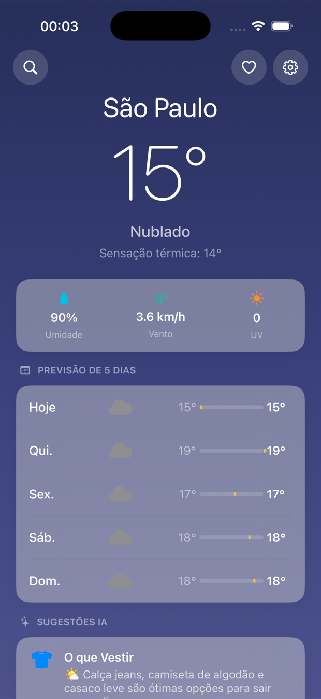
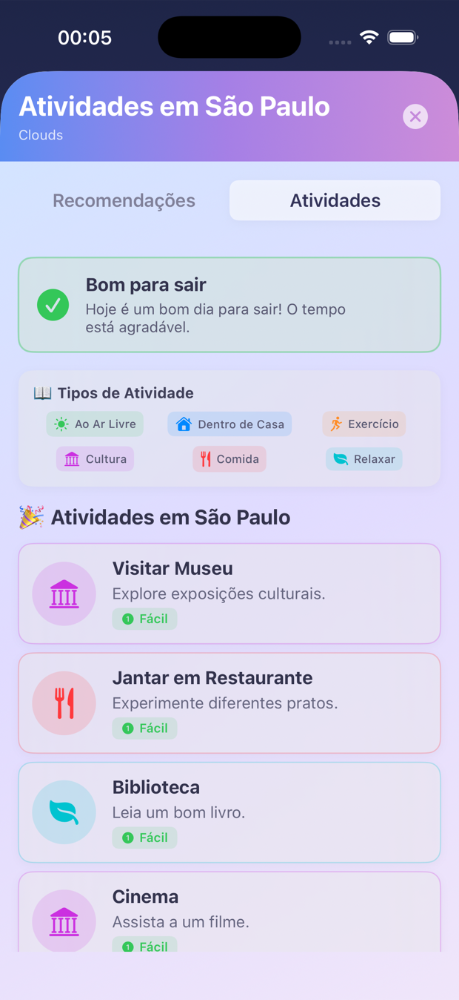
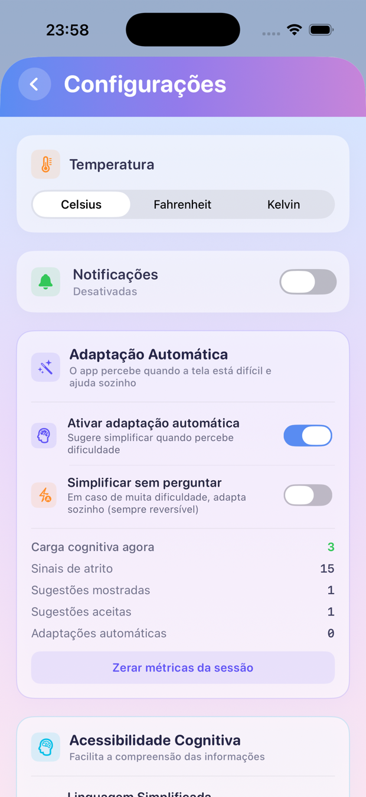
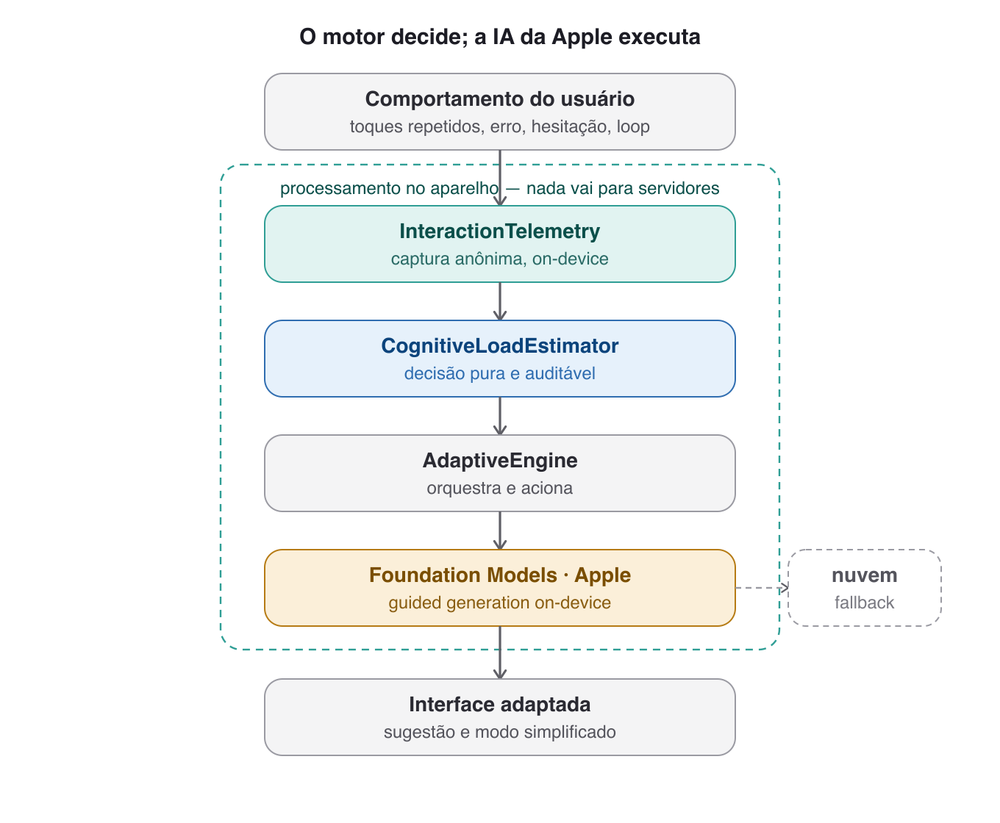

<div align="center">

# 🌤️ ClimaAgora

### Acessibilidade cognitiva em tempo real, com IA **on-device**


*Um app de clima que **percebe quando a tela está difícil e se adapta sozinho** — sem tirar o controle do usuário e sem enviar dados para servidores.*

</div>

---

## 📱 O app em ação

<div align="center">

| Clima | Adaptação automática | Atividades acessíveis | Controles + métricas |
|:---:|:---:|:---:|:---:|
|  |  |  |  |
| Clima e previsão, com sugestões de IA geradas no aparelho | O motor detecta dificuldade e **oferece** simplificar (você decide) | Semáforo de clima + cards de atividade em linguagem simples | Ligar/desligar a adaptação e ver a carga cognitiva em tempo real |

</div>

---

## ✨ O que torna o ClimaAgora diferente

A maioria dos apps deixa a acessibilidade escondida em menus de configuração — o usuário precisa saber que tem dificuldade e saber onde ajustar. O ClimaAgora inverte isso: **a interface observa o comportamento e se adapta sozinha**, mantendo o usuário no controle.

- 🧠 **Adaptação automática** — o app estima a carga cognitiva a partir de sinais de comportamento (toques repetidos, erros, hesitação, idas e voltas) e, ao perceber dificuldade, **sugere** simplificar a tela. Nada de configuração manual.
- 🗣️ **Linguagem simplificada por IA** — textos reescritos em frases curtas e vocabulário do dia a dia, gerados por um modelo de linguagem que roda **inteiramente no aparelho**.
- 🚦 **Semáforo de clima** — indica de forma intuitiva (🟢🟡🔴) se é seguro sair de casa.
- 🎯 **Cards de atividade estruturados** — sugestões com ícone, categoria e nível de esforço, produzidas por *guided generation* (sem parsing frágil de texto).
- 🙋 **Agência preservada** — a IA **convida, nunca impõe**: sugere antes de aplicar, tudo é reversível e transparente, e pode ser desligado por completo.
- 🔒 **Privacidade por design** — os sinais de interação e a geração de texto ficam **no dispositivo**; nada é enviado para servidores.

---

## 🧠 Como funciona o motor de adaptação

O princípio central: **o motor decide (lógica pura e auditável); a IA da Apple executa (gera o conteúdo adaptado).**

<div align="center">

</div>

1. **Telemetria on-device** captura sinais de interação de forma anônima.
2. O **`CognitiveLoadEstimator`** soma o peso desses sinais dentro de uma janela deslizante de 90s → uma estimativa de carga cognitiva.
3. Ao cruzar um limiar, o motor **sugere** simplificar; num limiar maior (e se autorizado), **adapta sozinho** — sempre reversível.
4. O **Foundation Models** (Apple Intelligence) gera o conteúdo simplificado localmente.

```swift
// Núcleo do estimador — puro e determinístico
func decide(events: [InteractionEvent], now: Date,
            alreadySimplified: Bool) -> AdaptationDecision {
    guard !alreadySimplified else { return .noChange }
    let s = score(events: events, now: now)        // soma dos pesos na janela
    if s >= autoThreshold    { return .autoSimplify }     // adapta
    if s >= suggestThreshold { return .suggestSimplified } // sugere
    return .noChange
}
```

---

## 🏗️ Arquitetura

Clean architecture em camadas, com a lógica de decisão isolada e testável:

```
ClimaAgora/
├── Domain/              # modelos e regras puras (CognitiveAdaptation, UseCases)
├── Data/                # repositórios, DTOs, mappers, rede
├── Presentation/        # ViewModels (State + RouteEvent)
├── Services/            # AdaptiveEngine, InteractionTelemetry, FoundationModels
└── Views/               # SwiftUI
ClimaUI/                 # Design System (Swift Package local)
```

- **Domínio puro** → o `CognitiveLoadEstimator` não depende de SwiftUI nem de rede, o que permite uma bateria de testes unitários determinísticos.
- **Roteamento de IA em duas camadas** → on-device (Foundation Models) com *fallback* para nuvem quando indisponível.

---

## 🚀 Como rodar

```bash
git clone https://github.com/FerNan0/ClimaTempo.git
cd ClimaTempo
```

1. Copie o template de chaves e preencha as suas:
   ```bash
   cp ClimaAgora/Services/Secrets.swift.example ClimaAgora/Services/Secrets.swift
   ```
   Edite `Secrets.swift` com sua chave do [OpenWeather](https://openweathermap.org/api) (`Secrets.swift` está no `.gitignore` e nunca é commitado).
2. Abra `ClimaAgora.xcodeproj` no **Xcode 26+**.
3. Rode em um simulador **iOS 26** (as sugestões de IA on-device usam o Apple Intelligence).

> As recomendações de IA rodam localmente via Foundation Models. Sem Apple Intelligence, o app usa um *fallback* em nuvem (opcional, requer chave OpenAI).

---

## 🎓 Contexto acadêmico

Este aplicativo é o artefato do Trabalho de Conclusão de Curso **"Aplicação de Inteligência Artificial para Acessibilidade Cognitiva em Aplicativos Móveis"** (MBA em Engenharia de Software — USP/Esalq).

A abordagem é fundamentada na **Teoria da Carga Cognitiva** (Sweller) e no princípio de **Inteligência Artificial Centrada no Humano** (Shneiderman): a IA como camada de apoio à decisão, e não como substituta do julgamento humano.

<div align="center">
<sub>Feito com foco em inclusão — porque tecnologia acessível é compromisso, não recurso extra.</sub>
</div>
